### Урок 1(Семинар)
* Выберите какой-нибудь проект на изучаемом вами языке программирования, с которым вы будете тренироваться работать в Git, и инициализируйте в папке этого проекта локальный репозиторий. Сами команды:
    * git init
    * git add filename
    * git commit -m "Comment"
    * git remote add origin idgithubfile
    * git push -u origin main
* Создайте непустой удалённый репозиторий (например, с файлом README.md) с именем, соответствующим имени этого проекта.
Подключите свой проект к этому удалённому репозиторию и отправьте в него код этого проекта. Самостоятельно разрешите конфликты и проблемы, если они возникнут при выполнении данного задания. 
    Если есть конфилкты то необходимо с начало сделать **git pull** из удаленного репозитория в локальный, чтобы файлы которые назодятся на удаленке перешли на локалку, после только **push**
-----------
### Урок 2(Семинар)
Данное домашнее задание является продолжением домашнего задания, которое вы выполняли на предыдущем семинаре в репозитории с собственным проектом.

1. Просмотрите историю коммитов в своём проекте и выберите три случайных коммита. Просмотрите изменения, которые были в них сделаны.
    Для просмотра истории используется команда **git log**
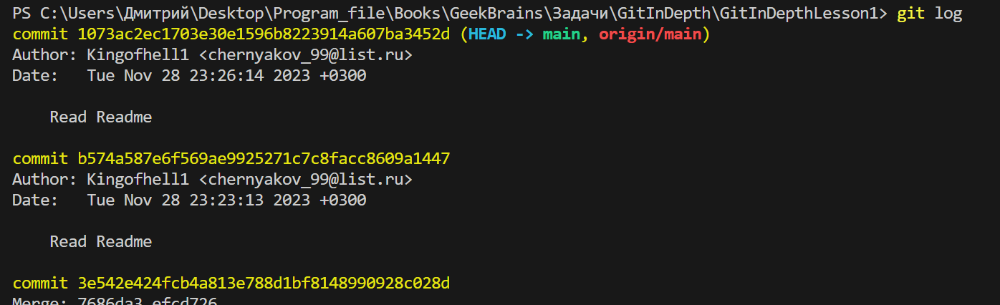
2. Верните эти изменения командой git revert последовательно, чтобы в итоге получилось тоже три коммита.
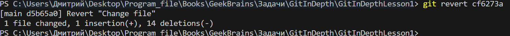
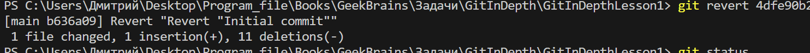
3. Попробуйте отменить эти три коммита:
* последний — командами git reset --soft и git restore;
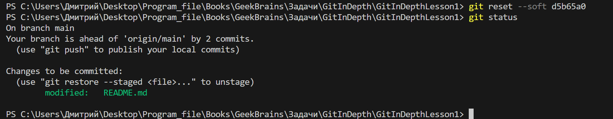
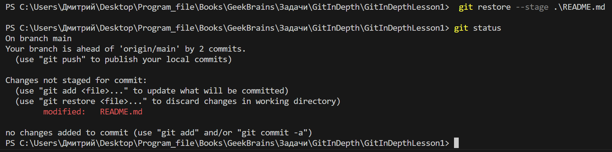
* предпоследний — командой git reset --mixed и git restore;
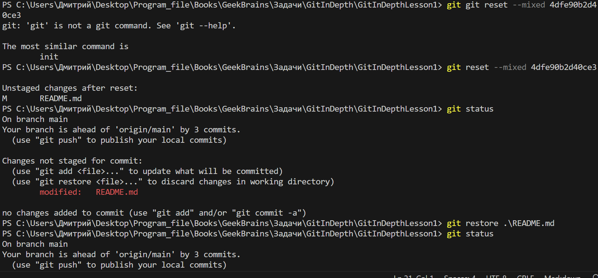
* первый — командой git reset --hard.
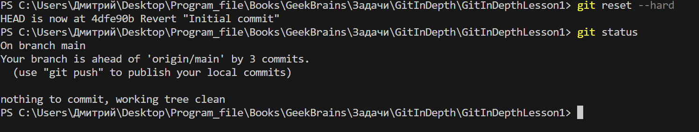
-------
### Урок 3(Семинары)

Пригласите в свой проект кого-то из коллег по обучению, дайте им доступ к своему репозиторию (кроме ветки master).
Защита ветки master 
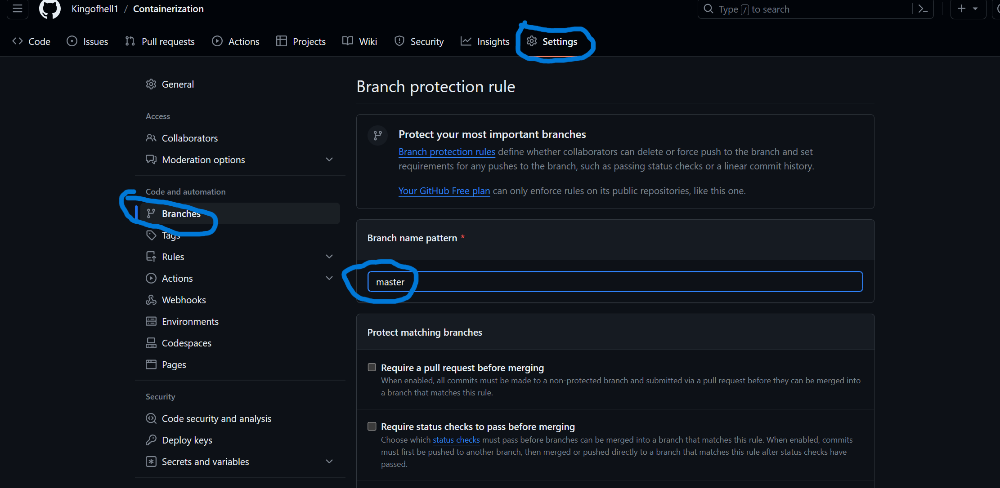 
Добавляем в проект коллег
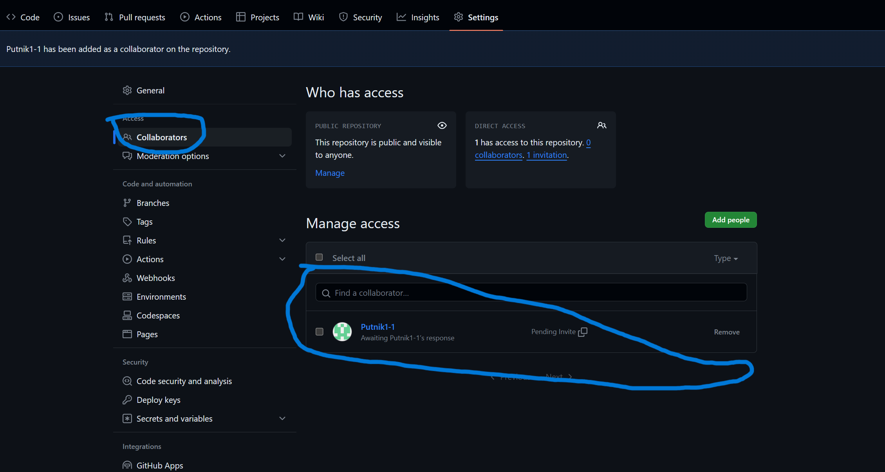
Поставьте ему в GitHub задачу по своему проекту, попросите её выполнить в отдельной ветке, а после выполнения — создать pull request и перевести задачу обратно на вас.
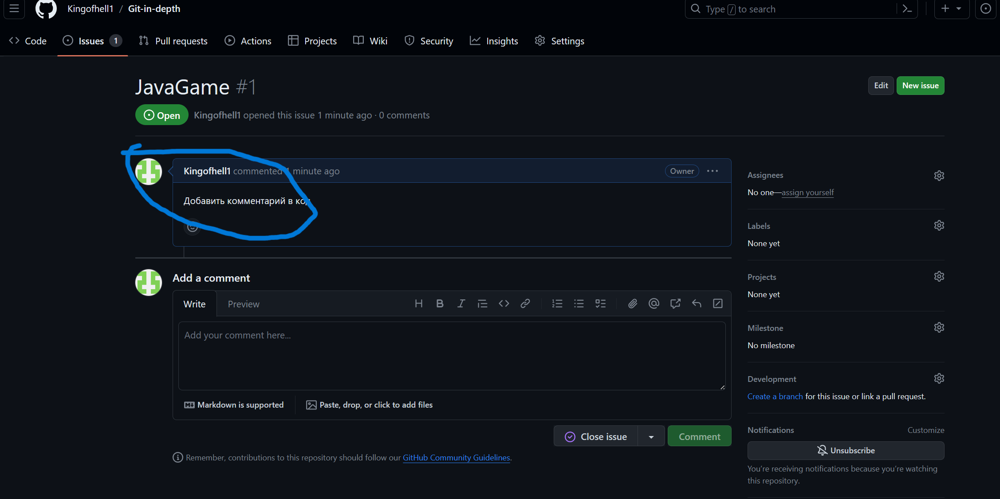
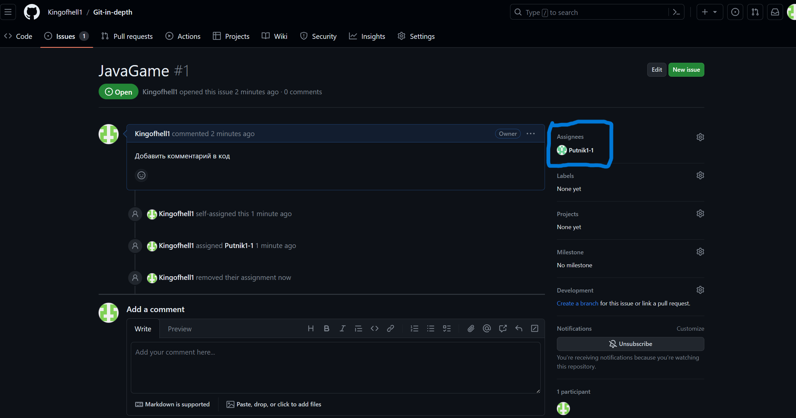
Проверьте выполнение задачи, примите pull request и удалите ветку, в которой решалась данная задача.
Проверка и принятие изменений
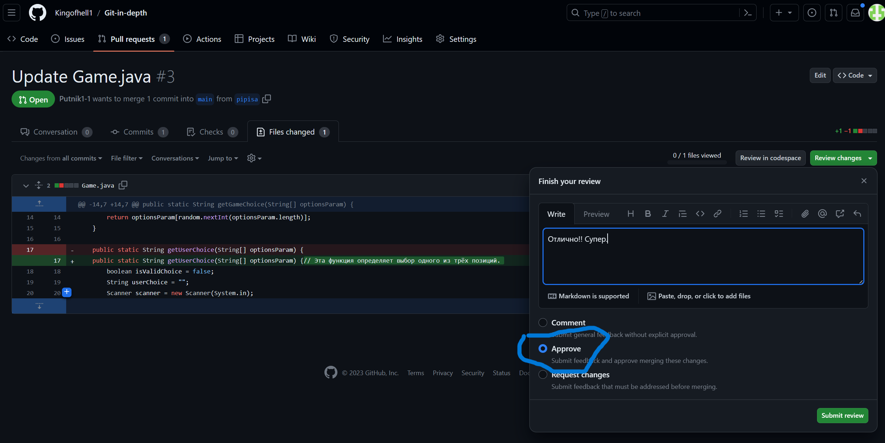
Удаление лишней ветки
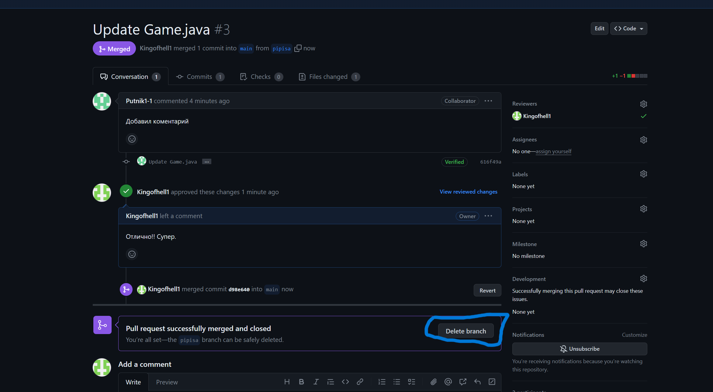
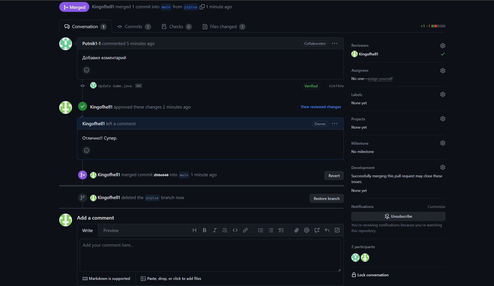

Сам код - это игра камень, ножницы, бумага.

Подготовил студент GeekBrains Черняков Дмитрий, Git-in-depth
